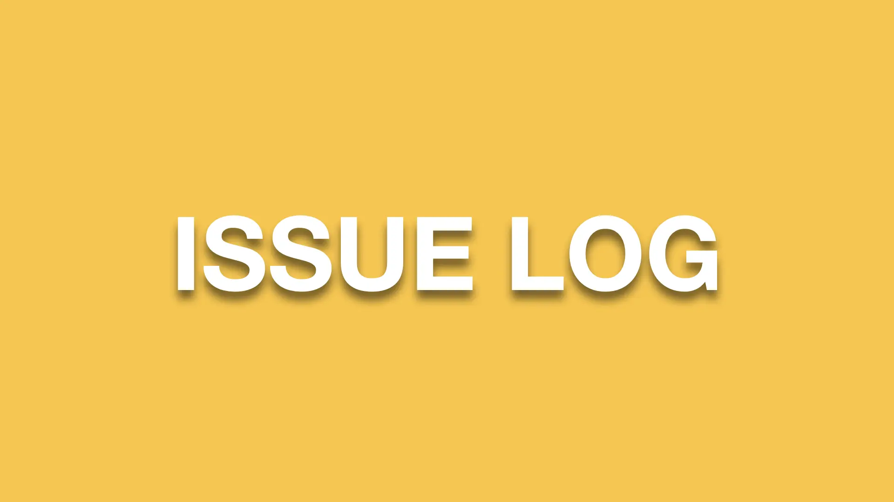

## 배경

현재 웹 프레임웍으로 생산되는 대다수의 코드는 `webpack`, `rollup` 등의 번들러에 의해 번들된 파일로 서빙된다. 번들된 파일에서 에러가 나는 경우 `source map`을 이용해서 파악할 수 있지만, `production` 환경의 경우 `source-map`을 함께 동반하지 않는 경우가 많고, 또 `vendor(library)` 코드의 경우는 하나의 파일에 여러 라이브러리 소스가 엮여 있기 때문에 어떤 라이브러리가 문제가 되는지 파악하기 더 어렵다.  아래 케이스 스터디를 통해 이런 상황에서 어떻게 이슈를 파악해 나가는지 파악해보자.

> e.g) 문제 발생시 번들된 파일명의 이름만 제공되기 때문에 소소코드 중 어떤 부분이 문제가 되는지 파악하기 어렵다.
> 

## 이슈

next.js 로 빌드된 어플리케이션을 74 버전의 크롬을 쓰는 안드로이드 브라우저에서 실행시 optional chaning( `.?` ) 관련 에러가 발생한다.

## 원인을 파악하는 과정

브라우저 상에서 오류가 나는 파일정보와 오류가 나는 부분에 대한 정보를 얻는다.


로컬에서 빌드한 뒤에 브라우저에서 오류가 발생했던 파일병과 똑같은 폴더 경로를 확보한다.


해당 파일을 열어서 오류가 나는 부분을 검색해서 `line` 과 `col` 위치 정보를 얻는다.


vscode 에서 [source map visualization](https://marketplace.visualstudio.com/items?itemName=larshp.vscode-source-map) 을 설치한다.


문제가 되는 번들 파일에 가서 `source map visualization` 을 켠다.


아래와 같은 view가 나오고 우측 상단에 line 과 col을 입력하게 되면 문제가 되는 코드로 focus 가 된다. 문제가 되는 코드에 마우스를 hover 하게 되면 해당 부분의 source를 원본파일에 mapping 시켜주고, 상단에서 원본파일의 어떤 library 가 문제의 원인이 되는지 파악할 수 있다.

위 코드에서는 query-string 이 해당 문제의 원인임을 알려주고 있다.

## 원인

해당 오류가 발생하기 이전 package 들을 전반적으로 최신 버전으로 업데이트 했다. 그 과정에서 `query-string` 도 업데이트 되었다. `query-string` [readme.md](https://github.com/sindresorhus/query-string)에 가보니 아래와 같은 문구가 적혀있엇다.
> For browser usage, this package targets the latest version of Chrome, Firefox, and Safari.

최신 브라우저만 지원한다는 말이다. next.js 에서 번들을 진행할 때 node-modues 하위에 있는 패키지들은 이미 트랜스파일링 된 것으로 간주하고 별도 babel, webpack등의 과정을 거치지 않는다. `query-string` 에서는  `optional-chaining` 문법을 쓰고 있는데 해당 문법은 웹뷰 안드로이드 80 버전부터 지원하는 문법이다.

따라서 해당 문법에 대한 babel preset이 적용되지 않아 오류가 발생한 것이다.

## 해결

`query-string` 사용처를 가보니 `queryParams` 객체를 `stringify` 해서 `queryString`을 만들기 위한 목적으로 쓰이고 있엇다. 해당 목적은 브라우저가 제공하는 `URLSearchParams` 클래스로도 동일하게 달성할 수 있어서 아래와 같이 변경했다.

```js
// before
stringify({
  text: `${shareContents.description}\n(${oneLink})\n`,
  hashtags: shareContents.hashtags,
});
// after
new URLSearchParams(paramObj).toString()
```

## 마치며

번들 파일에서 에러를 마주한 경우 해당 에러의 원인을 파악하기 까지 시간이 매우 오래 걸렸던 경헙이 있다. 이번 이슈 해결을 통해 소스맵을 잘 활용하여 보다 빠르게 문제를 파악하는 방법을 배울 수 있었다. 하위 호환성 브라우저에 대한 대응을 이어 나가는 팀의 경우 위 방법을 통해 보다 빠르게 문제를 해결할 수 있으면 좋겠다.
