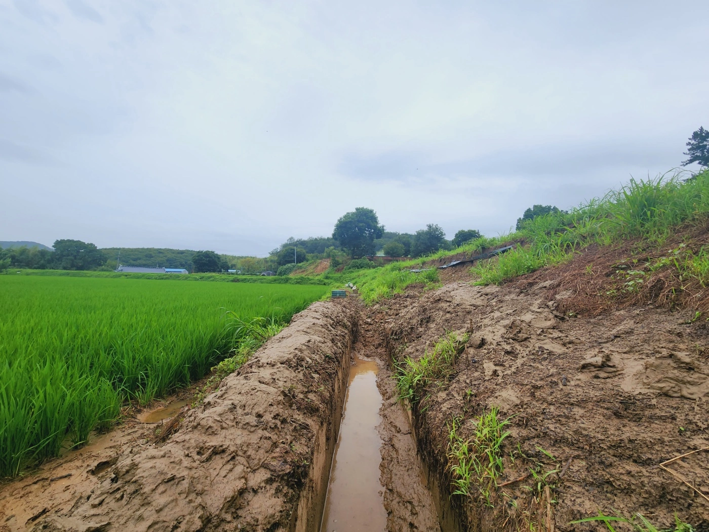

지난 주말 고향 익산에 기록적인 폭우가 쏟아졌다. 논에 흘러내린 빗물이 논이 가둘 수 있는 물의 양보다 많아 논둑 위로 넘쳤다. 상대적으로 약한 지반은 넘치는 물의 무게를 견디지 못하고 금세 무너졌다. 무너져 내린 쪽으로 물길이 열렸고 급물살에 둑을 지탱하던 흙이 떠내려와 논 아래 수로를 메웠다. 수로가 막히자 빗물은 흙이 가득찬 수로를 넘어 둑 아래 논으로 흘렀다.

이 상태로 비가 더 내리면 고도가 높은 순서로 논이 무너져 내린다. 빠르게 수로를 가득 메운 토사를 치워 물길을 열어야 한다. 집에 있는 노후한 부모님과 누나가 감당해야 할 수해는 가혹했다. 상황이 안 좋았지만, 부모님과 누나는 애써 웃었다. 더욱 예민한 나의 걱정을 걱정해서였나보다.

이 상황을 목도했던게 지난 일요일이다. 당시에 나는 직장 때문에 다시 서울에 올라가야 했다. 가는 내내 근심 걱정이 가득했고, 아무것도 할 수 없음에 무력했다. 일이 손에 잡히지 않아서 목금 휴가를 쓰고 집에 내려가서 돕기로 하고 집에 전화를 드렸다. “그래 주면 정말 고맙지” 엄마는 내심 미안해 보이는 말투로 이야기했다. 코끝이 찡. 고생길이 훤해서 겁을 먹었지만 속은 편했다.

그리고 집에 내려간 목요일 아침 첫 삽을 떴다. 흙으로 가득찬 수로는 미동도 없다. 첫 삽은 미미했고, 나는 막막했다. 막막함이 다음 삽의 무게를 더했다. 한 번은 더 해봐야 한다. 다음 삽을 뜬다. 큰 차이는 없다.

변화가 없는 지면을 보니 뜰 때마다 삽이 더 무겁다. 무거운 삽을 들고 멀리 보니 끝이 아득하고. 마음이 심란하다. 더 나아가려면 멀리 보지 않고 다음 삽에만 집중해야 한다. 그렇게 마음먹고 무겁지만 그렇게 다음 삽을 한 번 더 뜬다. 그 후로 몇십, 몇백 번의 삽질이 오갔다. 삽으로 퍼낸 흙들이 주변에 쌓이며 수로가 윤곽을 드러낸다. 하지만 수로에 물길을 내려면 더 많은 삽을 떠내야 한다. 나는 이미 지쳤다. 여기까지 하기로 하고 내일을 기약했다.

다음 날 아침에 잠에서 깬다. 수백 번의 삽질이 몸에 배겼다. 몸이 무겁지만, 그런대로 버털만 하다. 힘들었지만 다시 흙이 가득 찬 수로를 마주했다. 어제 해둔 삽질로 오늘은 더 구체적인 결말을 그리며 오늘의 첫 삽을 뜬다. 몸에 익어 그런지 어제보다 가볍다. 신이 나서 몇삽을 빠르게 뜬다. 끝이 선명하다.

그로부터 한참, 몇 삽을 떠내다 무거워 삽을 들 수가 없다. 살펴보니 흙을 덮은 촘촘한 차광망이 삽에 담긴 흙을 붙들고 있다. 둑으로 쌓은 흙의 유실을 막기 위해 흙 위에 차광망을 덮어둔다. 흙이 무너져 내린 후에도 차광망은 여전히 충실하게 흙을 떠내는 삽을 막아섰다. 차광망은 흙을 감싸고 그 위로 또 다른 흙이 쌓여있다. 차광망 위의 흙을 걷어내고, 낫으로 차광망을 찢고 다시 그 아래 흙을 다시 떠내야 했다. 생각보다 쉽지 않다. 힘이 빠져 한참을 쉬다 다시 삽을 든다. 그 찰나 하늘이 큰 물방울을 떨군다. 빗줄기가 거셌다. 날씨가 야속했다.

주어진 시간이 얼마 없어 비를 맞으며 삽을 더 뜬다. 비를 맞은 흙은 물을 머금어 진흙이 된다. 진흙은 점성이 있어 삽 표면에 붙어 쉽게 떨어지지 않는다. 삽질이 배로 어렵다. 이렇게 난처한 상황이면  “그럼에도 불구하고 다시 한번”을 되뇌곤 한다. 삽마다 힘을 실어 되뇐다. 그 말에 힘을 입어 상황에 금세 초연해진 나는 지쳐 퍼질 때까지 계속 삽을 뜬다.

그러기를 한참, 날이 벌써 어둑하다. 숨을 돌리며 흙더미를 확인한다. 몇 삽만 더 뜨면 물길이 열릴 기미가 보인다. 마지막을 생각하며 흙더미 깊숙이 힘껏 삽을 박는다. 그 찰나 손가락이 찌릿하며 칼에 베인 듯한 통증이 있다. 손가락에 물집이 생겨서다. 통증을 참으며 몇 삽을 더 뜨려 했으나, 아귀를 쥘 때마다 날카로운 통증으로 손가락이 아렸다. 삽을 더 뜰 수 없다. 체념하고 주변에 농기구를 모아 짊어지고 물이 흐르는 다른 수로로 터덜터덜 걸었다.

수로가 서로 마주하여 더 높은 수로의 물이 아래 수로로 떨어지는 곳에 가서 진흙 덮인 몸을 기댔다. 산 정상부터 흘러온 물이 차갑다. 그 물로 진흙 덮인 몸과 농기구를 씻었다. 찬물을 몸에 맞고 있자니 여러 생각이 든다. 가혹했던 폭우, 폭우로 벌어진 상황에 대한 걱정, 어렵게 낸 결심 그리고 코 끝이 찡했던 기억이 떠올랐다 잠긴다. 아득했던 첫 삽과 온갖 어려움이 그 뒤로 스친다. 씻겨나간 생각들이 비운 공백, 그 사이로  감사함이 피어오른다. “참 다행이다.  아직 물길을 뚫어내진 못했지만 여기까지 올 수 있어서, 걱정으로 끝내지 않고 걱정을 동력 삼아 용기 낼 수 있어서, 때마침 단단히 운동을 해둔 몸이 고된 삽질을 버텨낼 수 있어 정말 다행이다.”

많은 어려움이 있다. 앞으로 펼쳐진 곳곳에 있을 또 다른 어려움도 분명하다. 그런데도 어려움과 동반하여 흐르는 삶에 대해 작게 긍정한다. “내가 극복할 수 있는 어려움은 나를 성장시킨다.”라는 철학자의 격언이나,  “이번에 잘 극복했으니, 다음에는 더 큰 어려움이 와도 잘 극복할 거야” 하는 거창한 기대  때문은 아니다. “굳이 어려움을 통해서 아프게 성장해야 하는가?” 의문을 품으며, 나는 가능하다면 꽃길만 걷고 싶다. 그리고 새로운 어려움은 늘 새롭게 두렵더라.

어려움은 내 상태를 봐주지 않고 갑작스레 들이닥친다. 내 의지로 조절할 수 없다. 불가항력이다. 어려움은 보편적이다. 나만 어렵지 않다. 사람들은 각자 나름으로 어렵다. “어쩔 수 없음” 그리고 “나만 그런 거 아님(심보가 좀 고약하지만)”이 주는 안정감이 내 긍정의 토대다.  생각과 감정이 산정한 어려움의 크기와 실제 내가 마주한 어려움의 크기가 달랐던 일련의 경험도 있다. 경험마다 생각보다 괜찮아서 안도하고, 생각보다 괜찮을 수 있음에 감사했다. 그 경험들이 모여 생각보다 괜찮을 수 있다는 생각이 뿌리를 내렸다. 그렇게 뿌리 내린 생각이 내 작은 긍정을 떠받든다.

어려운 시기다. 모두가 두렵고 어려운 상황에 아득한 첫 삽을 뜬다. 멀고 험난한 길이 분명하다.  조바심이 나기도 한다. 그래도 정직하게 조금씩 파고들어간 그 길의 끝이 생각보다 괜찮았으면 한다. 그 경험을 통해 앞으로 예비된 다른 어려움에도 일말의 긍정을 가졌으면 한다. 진흙에 뒤덮인 몸을 찬물에 씻어내며 생각보다 괜찮았다고 생각이 들었던 그 날 그 순간처럼 말이다.