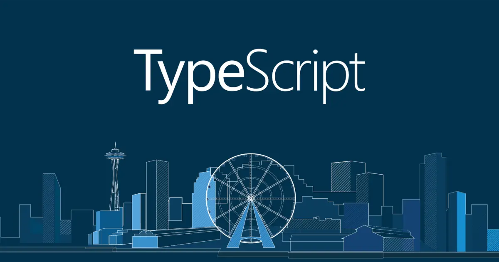

## 타입스크립트의 구조적 타이핑(Structural Typing)


타입스크립트의 구조적 타이핑 (Structural Typing)은 프로그래밍에서 타입 호환성이나 타입 검사 방식을 결정하는 방식이다. 구조적 타이핑 (Structural Typing)는 값의 형태에 따라 타입을 결정한다. 즉, 타입을 체크할 때 타입의 이름이나 선언 방식이 아닌 그 구조를 확인한다. 예를 들어보자.

```typescript
interface Point2D {
    x: number;
    y: number;
}

interface Point3D {
    x: number;
    y: number;
    z: number;
}

let point2D: Point2D = { x: 0, y: 10 };
let point3D: Point3D = { x: 0, y: 10, z: 20 };

function printPoint2D(point: Point2D) {
    console.log(`X: ${point.x}, Y: ${point.y}`);
}


PrintPoint2D(point3D); // 할당 가능함
```

위 코드에는 `Point2D`와 `Point3D` 두 인터페이스가 있다. `Point2D`는 x와 y를 가지고 있고, `Point3D`는 추가로 z를 가지고 있다.

`printPoint2D` 함수는 `Point2D` 타입의 객체를 인수로 받지만, `Point3D` 타입의 `point3D`를 인자로 넘겨도 오류가 발생하지 않는다. `Point3D`는 `Point2D`의 모든 프로퍼티를 포함하므로 `Point2D`를 기대하는 위치에서 동일하게 사용할 수 있다. 이것이 바로 구조적 타이핑 (Structural Typing) 인 것이다. 구조만 같다면 할당이 가능하다. 

이러한 방식으로 구조적 타이핑은 코드의 유연성을 높여주고, 다양한 상황에서 같은 인터페이스를 적용할 수 있게 한다. 이는 "덕 타이핑" (duck typing)이라고도 부른다. "만약 어떤 새가 오리처럼 걷고, 오리처럼 꽥꽥거린다면 그것은 오리일 것이다"라는 논리를 따르기 때문에 덕 타이핑이라고 이름을 붙였다. 

자바스크립트는 동적 타이핑 언어로, 변수의 타입이 실행시점에 결정된다. 반면 타입스크립트는 컴파일 시점에 타입 검사를 수행하는 정적 타이핑 언어다. 이러한 차이에도 불구하고 타입스크립트는 자바스크립트와 호환성을 유지하기 위해 구조적 타이핑을 채택했다.

## 이슈 

```typescript
interface Point {
    x: number;
    y: number;
}

const point: Point = { x: 10, y: 20, z: 30 };	
```

타입스크립트의 구조적 타이핑을 따른다. 따라서  위 코드는 문제가 없다. `{ x: 10, y: 20, z: 30 }` 는 `Point` 타입과 구조적으로 동일하기 때문이다. 그러나 위 코드는 타입체크에서 실패한다. 


무엇이 문제가 된 걸까? 바로 `excess property check` 개념이 필요한 순간이다. 

## Excess Property Check

`excess property checks`는 TypeScript에서 객체 리터럴이 다른 타입에 할당될 때 발생하는 추가적인 체크를 의미한다. 다시 말해 객체리터럴을 특정 타입에 할당할 때 해당 타입이 실제로 필요로 하는 프로퍼티 이외에 추가적인 프로퍼티가 존재하는지 체크해서 추가적인 프로퍼티가 있다면 타입 에러를 발생시킨다.  

그렇다면 왜 이런 예외를 둔 것일까? 객체 리터럴을 작성하는 것이 사람이기 때문이다. 더 정확히는 사람이 직접입력할 때 발생하는 휴먼에러의 방지하기 위해서다. 아래 이미지를 살펴보자.  


사람이 직접 객체 리터럴을 입력하다 보니 `subtitle` property 를  `subtitl` 로 잘못입력할 수 있다.  휴먼 에러 방지를 위해`IDE` 는 오입력을 탐지해서 `subtitl` 이 아니라 `subtitle` 을 입력해야 한다고 사람에게 인지시켜야 한다. 

구조적 타이핑을 적용한다면 프로퍼티의 오입력을 구분할 수 없다. 구조적 타이핑이 적용됬을 때 `{ title: 'red', subtitle: 'green', subtitl: 'blue' }` 은 구조적으로 `TitleColor` 와 동일하므로 할당 가능하며, 타입 에러가 아니다.  `subtitle` 은 추가적으로 입력가능한 property 일 뿐 오입력이 아니게 된다. 오입력을 가려내기 위해서는 구조적 타이핑을 적용하지 않고 property check를 해야한다. 

이런 이유로 휴먼에러가 발생하기 쉬운 객체리터럴에 예외적으로 `excess property check` 를 적용 한다. 아래 코드는 동일하게 사람이 손수 입력해야 하는 구조분해(destructuring) 할당에 `excess property check` 가 적용된 에시이다. 


 위와 같이 타입스크립트는 `excess property check` 를 통해 휴먼에러가 발생가능한 순간에  잘못된 프로퍼티 이름이나 오타로 인한 버그를 방지할 수 있다.

## Summary

타입스크립트는 자바스크립트로 부터 마이그레이션이 쉽게 하기 위해 구조적 타이핑을 채택했다. 구조적 타이핑은 타입을 체크할 때 타입의 이름이나 선언 방식이 아닌 그 구조를 확인한 후 구조가 같다면 같은 타입이라고 간주한다. 그러나 구조적 타이핑의 예외가 적용되는 시나리오가 있다. 바로 휴먼에러가 개입될 수 있는 순간들이다. 객체리터럴, 구조분해할당 등이 휴먼에러가 발생가능한 시나리오에 속한다. 이때 인간의 오입력을 구분하기 위해서는 할당하고자 하는 타입과 객체리터럴의 타입이 동일한지 추가적으로 체크해야 한다. 따라서 이때 `excess property check`  가 예외적으로 적용된다. 

앞으로 타입스크립트를 사용하면서 구조적타이핑의 예상을 빗나가는 순간들을 마주할 때  `excess property check` 를 떠올려보자. 생각보다 사람을 배려한 타입스크립트를 더욱 사랑하게 될지 모른다  